How each long-running process in X-Nix moves, from the outside in. File names point at the code that does each step.

## A job's life

Every job, of any kind, moves through the same three states. The owner creates the row when it starts the run, and
finishes it when the run's exit status arrives or the start fails.

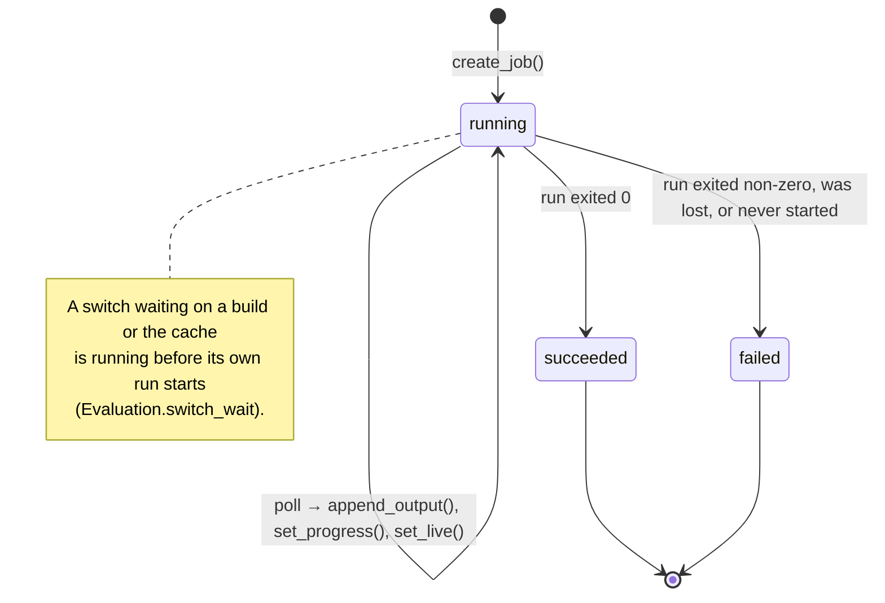
```mermaid
stateDiagram-v2
    [*] --> running: create_job()
    running --> running: poll → append_output(), set_progress(), set_live()
    running --> succeeded: run exited 0
    running --> failed: run exited non-zero, was lost, or never started
    succeeded --> [*]
    failed --> [*]

    note right of running
        A switch waiting on a build or the cache
        is running before its own run starts
        (Evaluation.switch_wait).
    end note
```

## Agent connection and login

`src/server/agents/hub.ts`, `src/agent/agent.ts`, X-Libs `agent/client` and `server/agents/hub`.

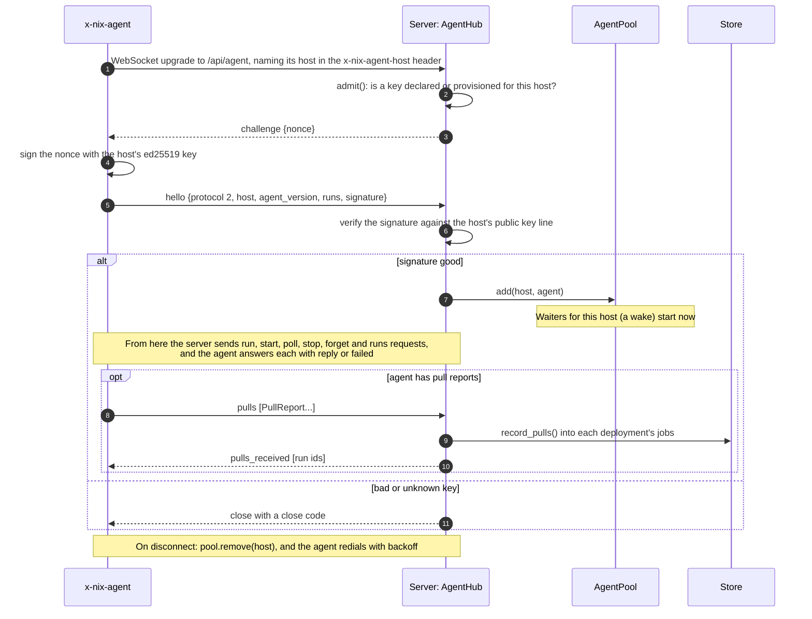
```mermaid
sequenceDiagram
    autonumber
    participant agent as x-nix-agent
    participant hub as Server: AgentHub
    participant pool as AgentPool
    participant store as Store

    agent->>hub: WebSocket upgrade to /api/agent, naming its host in the x-nix-agent-host header
    hub->>hub: admit(): is a key declared or provisioned for this host?
    hub-->>agent: challenge {nonce}
    agent->>agent: sign the nonce with the host's ed25519 key
    agent->>hub: hello {protocol 2, host, agent_version, runs, signature}
    hub->>hub: verify the signature against the host's public key line
    alt signature good
        hub->>pool: add(host, agent)
        Note over pool: Waiters for this host (a wake) start now
        Note over hub,agent: From here the server sends run, start, poll, stop, forget and runs requests,<br/>and the agent answers each with reply or failed
        opt agent has pull reports
            agent->>hub: pulls [PullReport...]
            hub->>store: record_pulls() into each deployment's jobs
            hub-->>agent: pulls_received [run ids]
        end
    else bad or unknown key
        hub-->>agent: close with a close code
    end
    Note over agent,hub: On disconnect: pool.remove(host), and the agent redials with backoff
```

## Long runs

A long run is how anything slow survives restarts. X-Libs `agent/long_runs` and `server/runs`; X-Nix's
`src/agent/tasks.ts`, `src/agent/runner.ts`, `src/server/runs.ts`.

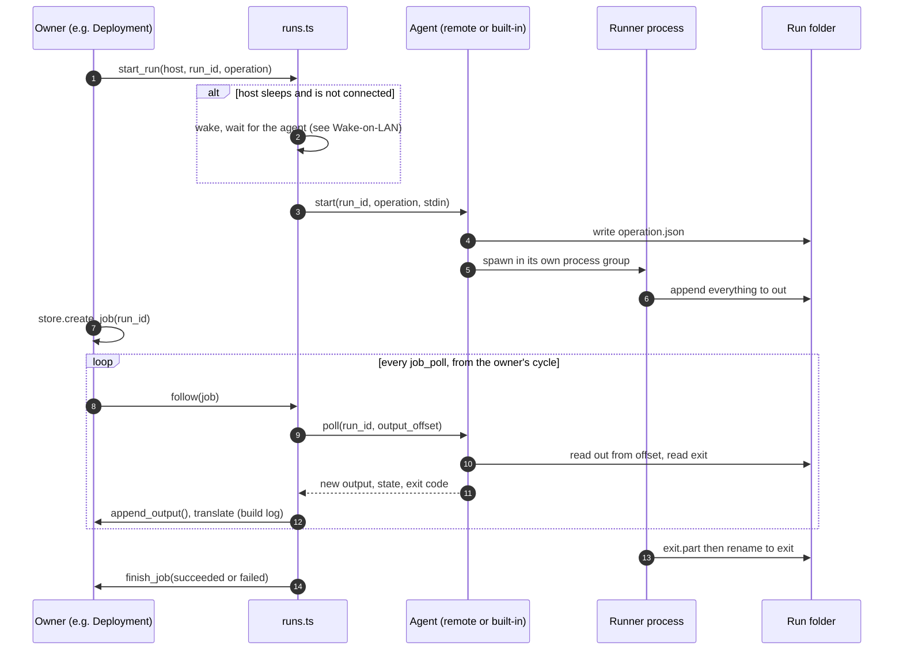
```mermaid
sequenceDiagram
    autonumber
    participant owner as Owner (e.g. Deployment)
    participant runs as runs.ts
    participant agent as Agent (remote or built-in)
    participant runner as Runner process
    participant folder as Run folder

    owner->>runs: start_run(host, run_id, operation)
    alt host sleeps and is not connected
        runs->>runs: wake, wait for the agent (see Wake-on-LAN)
    end
    runs->>agent: start(run_id, operation, stdin)
    agent->>folder: write operation.json
    agent->>runner: spawn in its own process group
    runner->>folder: append everything to out
    owner->>owner: store.create_job(run_id)
    loop every job_poll, from the owner's cycle
        owner->>runs: follow(job)
        runs->>agent: poll(run_id, output_offset)
        agent->>folder: read out from offset, read exit
        agent-->>runs: new output, state, exit code
        runs->>owner: append_output(), translate (build log)
    end
    runner->>folder: exit.part then rename to exit
    runs->>owner: finish_job(succeeded or failed)
```

The runner never depends on the agent or the server: either can restart, and the next poll continues from
`output_offset`. A run whose process is gone without an `exit` file reads as `lost` and fails the job.

## The poller

`src/server/poller.ts` over X-Libs' `CyclePoller`. Every owner gets its own timer.

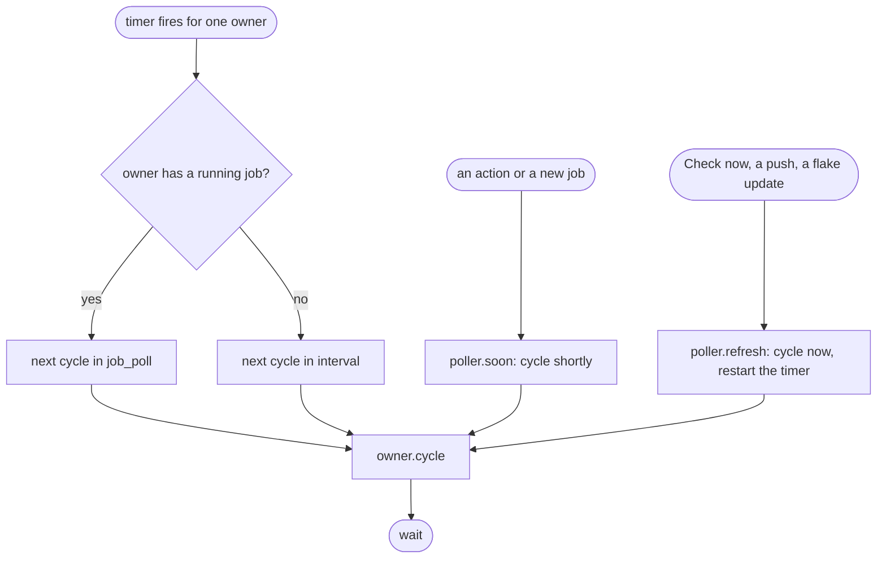
```mermaid
flowchart TD
    start([timer fires for one owner]) --> busy{owner has a running job?}
    busy -- yes --> short[next cycle in job_poll]
    busy -- no --> long[next cycle in interval]
    short & long --> cycle[owner.cycle]
    cycle --> done([wait])
    action([an action or a new job]) --> soon[poller.soon: cycle shortly]
    refresh([Check now, a push, a flake update]) --> now[poller.refresh: cycle now, restart the timer]
    soon & now --> cycle
```

## A deployment's cycle

`Deployment.cycle()` in `src/server/deployment.ts`. Cycles of one deployment run one at a time (`serial`).

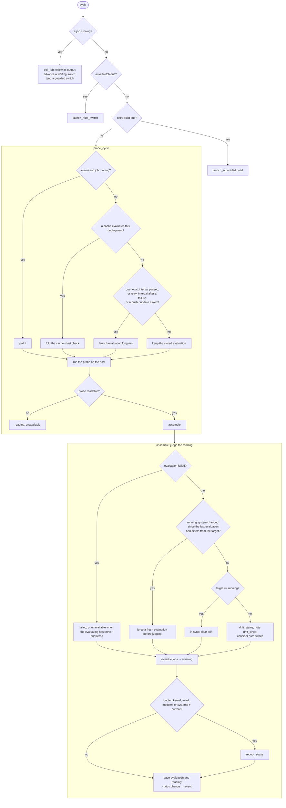
```mermaid
flowchart TD
    cycle([cycle]) --> job{a job running?}
    job -- yes --> poll[poll_job: follow its output;<br/>advance a waiting switch;<br/>tend a guarded switch]
    job -- no --> auto{auto switch due?}
    auto -- yes --> launch_auto[launch_auto_switch]
    auto -- no --> sched{daily build due?}
    sched -- yes --> launch_sched[launch_scheduled build]
    sched -- no --> probe_cycle

    subgraph probe_cycle[probe_cycle]
        direction TB
        e1{evaluation job running?} -- yes --> e_poll[poll it]
        e1 -- no --> e2{a cache evaluates this deployment?}
        e2 -- yes --> e_cache[fold the cache's last check]
        e2 -- no --> e3{due: eval_interval passed,<br/>or retry_interval after a failure,<br/>or a push / update asked?}
        e3 -- yes --> e_launch[launch evaluation long run]
        e3 -- no --> e_keep[keep the stored evaluation]
        e_poll & e_cache & e_launch & e_keep --> probe[run the probe on the host]
        probe --> readable{probe readable?}
        readable -- no --> unavailable[reading: unavailable]
        readable -- yes --> assemble[assemble]
    end

    assemble --> judge
    subgraph judge[assemble: judge the reading]
        direction TB
        j1{evaluation failed?} -- yes --> j_fail[failed, or unavailable when the evaluating host never answered]
        j1 -- no --> j2{running system changed since the last evaluation<br/>and differs from the target?}
        j2 -- yes --> j_force[force a fresh evaluation before judging]
        j2 -- no --> j3{target == running?}
        j3 -- yes --> j_sync[in sync; clear drift]
        j3 -- no --> j_drift[drift_status; note drift_since;<br/>consider auto switch]
        j_fail & j_force & j_sync & j_drift --> j4[overdue jobs → warning]
        j4 --> j5{booted kernel, initrd, modules or systemd ≠ current?}
        j5 -- yes --> j_reboot[reboot_status]
        j5 -- no --> j_save
        j_reboot --> j_save[save evaluation and reading;<br/>status change → event]
    end
```

### Automatic switch

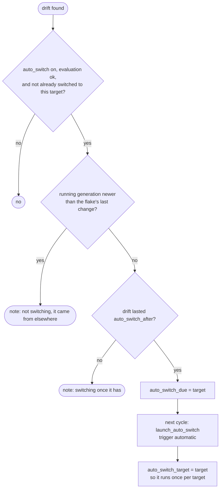
```mermaid
flowchart TD
    drift([drift found]) --> on{auto_switch on, evaluation ok,<br/>and not already switched to this target?}
    on -- no --> stop([no])
    on -- yes --> newer{running generation newer<br/>than the flake's last change?}
    newer -- yes --> refuse([note: not switching, it came from elsewhere])
    newer -- no --> long{drift lasted auto_switch_after?}
    long -- no --> wait([note: switching once it has])
    long -- yes --> due[auto_switch_due = target]
    due --> next[next cycle: launch_auto_switch<br/>trigger automatic]
    next --> mark[auto_switch_target = target<br/>so it runs once per target]
```

## Build and switch

`Deployment.act()`, `wait_for_dependencies()`, `advance_build()`, `advance_push()`, `start_switch()`.

### Where it builds

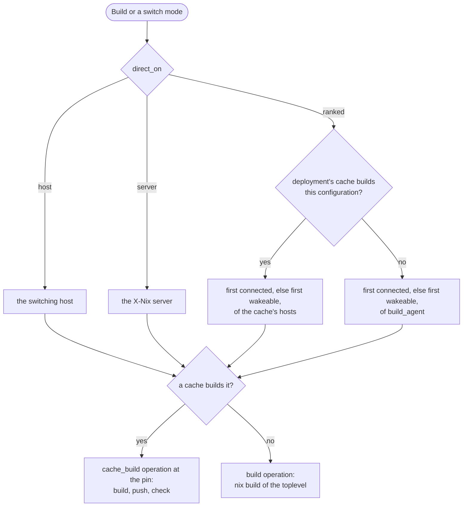
```mermaid
flowchart TD
    act([Build or a switch mode]) --> direct{direct_on}
    direct -- host --> h[the switching host]
    direct -- server --> s[the X-Nix server]
    direct -- ranked --> c{deployment's cache builds<br/>this configuration?}
    c -- yes --> ch[first connected, else first wakeable,<br/>of the cache's hosts]
    c -- no --> ba[first connected, else first wakeable,<br/>of build_agent]
    h & s & ch & ba --> op{a cache builds it?}
    op -- yes --> cop[cache_build operation at the pin:<br/>build, push, check]
    op -- no --> bop[build operation:<br/>nix build of the toplevel]
```

### A switch's steps

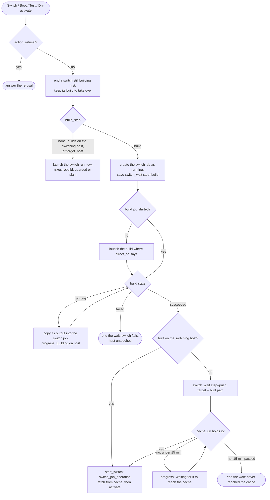
```mermaid
flowchart TD
    act([Switch / Boot / Test / Dry activate]) --> refuse{action_refusal?}
    refuse -- yes --> no([answer the refusal])
    refuse -- no --> pre[end a switch still building first;<br/>keep its build to take over]
    pre --> step{build_step}
    step -- "none: builds on the switching host,<br/>or target_host" --> direct[launch the switch run now:<br/>nixos-rebuild, guarded or plain]
    step -- build --> job[create the switch job as running;<br/>save switch_wait step=build]
    job --> b1{build job started?}
    b1 -- no --> b_launch[launch the build where direct_on says]
    b_launch --> b2
    b1 -- yes --> b2{build state}
    b2 -- running --> b_prog[copy its output into the switch job;<br/>progress: Building on host]
    b_prog --> b2
    b2 -- failed --> fail([end the wait: switch fails,<br/>host untouched])
    b2 -- succeeded --> same{built on the switching host?}
    same -- yes --> start
    same -- no --> push[switch_wait step=push, target = built path]
    push --> holds{cache_url holds it?}
    holds -- yes --> start[start_switch: switch_job_operation<br/>fetch from cache, then activate]
    holds -- "no, under 15 min" --> wait[progress: Waiting for it to reach the cache]
    wait --> holds
    holds -- "no, 15 min passed" --> fail2([end the wait: never reached the cache])
```

`switch_wait` lives in the deployment's stored `Evaluation`, so a restart of the server picks up a waiting switch
exactly where it stood. Each poll of the switch job calls `advance_wait()`.

## A guarded switch

`src/agent/operations/switch.ts`, `src/agent/watchdog.ts`, `Deployment.tend_switch()`.
The switch prints `@@x-nix-switch` marker lines (`phase …`, `activated`, `awaiting-confirmation`, `refused …`,
`outcome …`), which `switch_verdict()` reads.

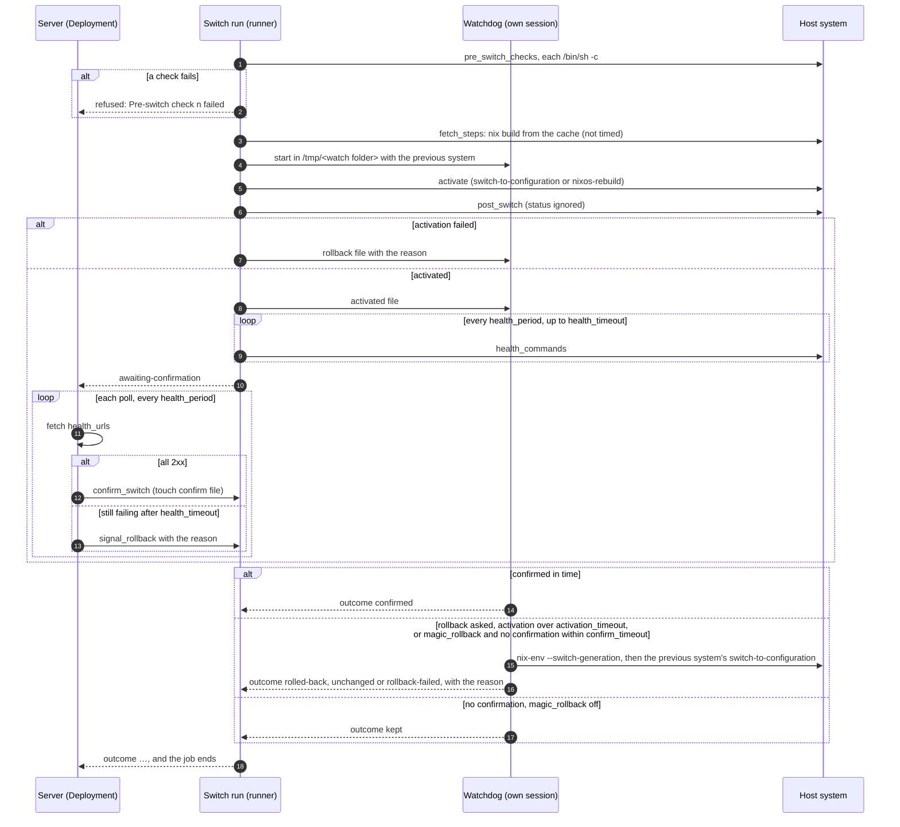
```mermaid
sequenceDiagram
    autonumber
    participant server as Server (Deployment)
    participant run as Switch run (runner)
    participant wd as Watchdog (own session)
    participant host as Host system

    run->>host: pre_switch_checks, each /bin/sh -c
    alt a check fails
        run-->>server: refused: Pre-switch check n failed
    end
    run->>host: fetch_steps: nix build from the cache (not timed)
    run->>wd: start in /tmp/<watch folder> with the previous system
    run->>host: activate (switch-to-configuration or nixos-rebuild)
    run->>host: post_switch (status ignored)
    alt activation failed
        run->>wd: rollback file with the reason
    else activated
        run->>wd: activated file
        loop every health_period, up to health_timeout
            run->>host: health_commands
        end
        run-->>server: awaiting-confirmation
        loop each poll, every health_period
            server->>server: fetch health_urls
            alt all 2xx
                server->>run: confirm_switch (touch confirm file)
            else still failing after health_timeout
                server->>run: signal_rollback with the reason
            end
        end
    end
    alt confirmed in time
        wd-->>run: outcome confirmed
    else rollback asked, activation over activation_timeout,<br/>or magic_rollback and no confirmation within confirm_timeout
        wd->>host: nix-env --switch-generation, then the previous system's switch-to-configuration
        wd-->>run: outcome rolled-back, unchanged or rollback-failed, with the reason
    else no confirmation, magic_rollback off
        wd-->>run: outcome kept
    end
    run-->>server: outcome …, and the job ends
```

The watchdog's own states:

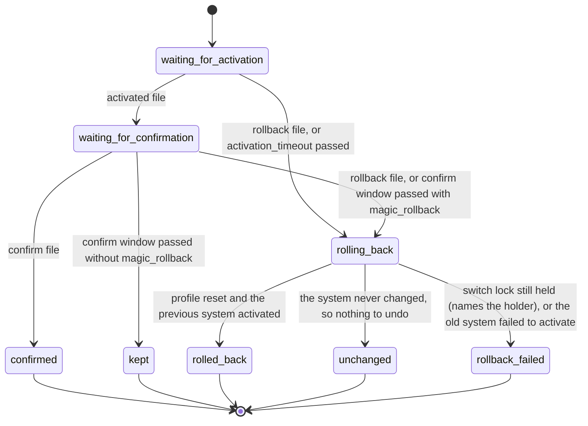
```mermaid
stateDiagram-v2
    [*] --> waiting_for_activation
    waiting_for_activation --> rolling_back: rollback file, or activation_timeout passed
    waiting_for_activation --> waiting_for_confirmation: activated file
    waiting_for_confirmation --> confirmed: confirm file
    waiting_for_confirmation --> rolling_back: rollback file, or confirm window passed with magic_rollback
    waiting_for_confirmation --> kept: confirm window passed without magic_rollback
    rolling_back --> unchanged: the system never changed, so nothing to undo
    rolling_back --> rollback_failed: switch lock still held (names the holder), or the old system failed to activate
    rolling_back --> rolled_back: profile reset and the previous system activated
    confirmed --> [*]
    kept --> [*]
    rolled_back --> [*]
    unchanged --> [*]
    rollback_failed --> [*]
```

## Flake reads, input checks and Update

`src/server/flake.ts`, `src/server/nixos/commands.ts`, `src/agent/operations/deploy.ts`.

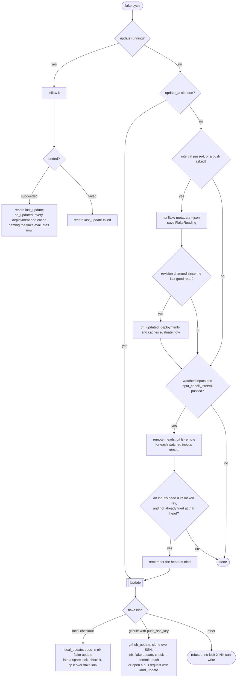
```mermaid
flowchart TD
    cycle([flake cycle]) --> running{update running?}
    running -- yes --> follow[follow it]
    follow --> ended{ended?}
    ended -- succeeded --> updated[record last_update;<br/>on_updated: every deployment and cache<br/>naming the flake evaluates now]
    ended -- failed --> record[record last_update failed]
    running -- no --> daily{update_at slot due?}
    daily -- yes --> update
    daily -- no --> meta{interval passed, or a push asked?}
    meta -- yes --> read[nix flake metadata --json;<br/>save FlakeReading]
    read --> changed{revision changed since the last good read?}
    changed -- yes --> notify[on_updated: deployments and caches evaluate now]
    changed -- no --> check
    notify --> check
    meta -- no --> check{watched inputs and<br/>input_check_interval passed?}
    check -- yes --> heads[remote_heads: git ls-remote<br/>for each watched input's remote]
    heads --> moved{an input's head ≠ its locked rev,<br/>and not already tried at that head?}
    moved -- yes --> tried[remember the head as tried] --> update
    moved -- no --> idle([done])
    check -- no --> idle

    update[[Update]] --> kind{flake kind}
    kind -- "local checkout" --> local[local_update: sudo -n nix flake update<br/>into a spare lock, check it, cp it over flake.lock]
    kind -- "github: with push_ssh_key" --> gh[github_update: clone over SSH,<br/>nix flake update, check it, commit, push<br/>or open a pull request with land_update]
    kind -- other --> refuse([refused: no lock X-Nix can write])
```

## Push webhook

`src/server/webhook.ts`, X-Libs `server/forge_webhook`.

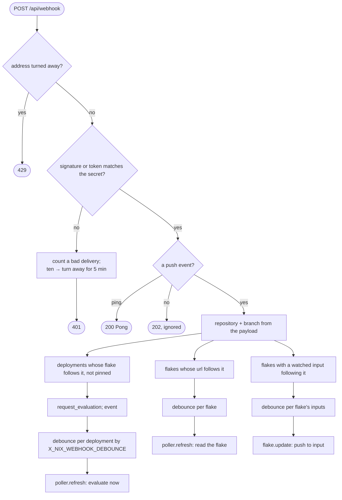
```mermaid
flowchart TD
    post([POST /api/webhook]) --> limited{address turned away?}
    limited -- yes --> r429([429])
    limited -- no --> sig{signature or token matches the secret?}
    sig -- no --> count[count a bad delivery;<br/>ten → turn away for 5 min] --> r401([401])
    sig -- yes --> push{a push event?}
    push -- "ping" --> pong([200 Pong])
    push -- no --> ignore([202, ignored])
    push -- yes --> repo[repository + branch from the payload]
    repo --> d[deployments whose flake follows it, not pinned]
    repo --> f[flakes whose url follows it]
    repo --> i[flakes with a watched input following it]
    d --> ask[request_evaluation; event] --> debounce[debounce per deployment by X_NIX_WEBHOOK_DEBOUNCE] --> eval[poller.refresh: evaluate now]
    f --> debounce_f[debounce per flake] --> read[poller.refresh: read the flake]
    i --> debounce_i[debounce per flake's inputs] --> upd[flake.update: push to input]
```

## Cache check and Build all

`src/server/cache.ts`, `src/server/nixos/attic.ts`, `src/agent/operations/cache.ts`.

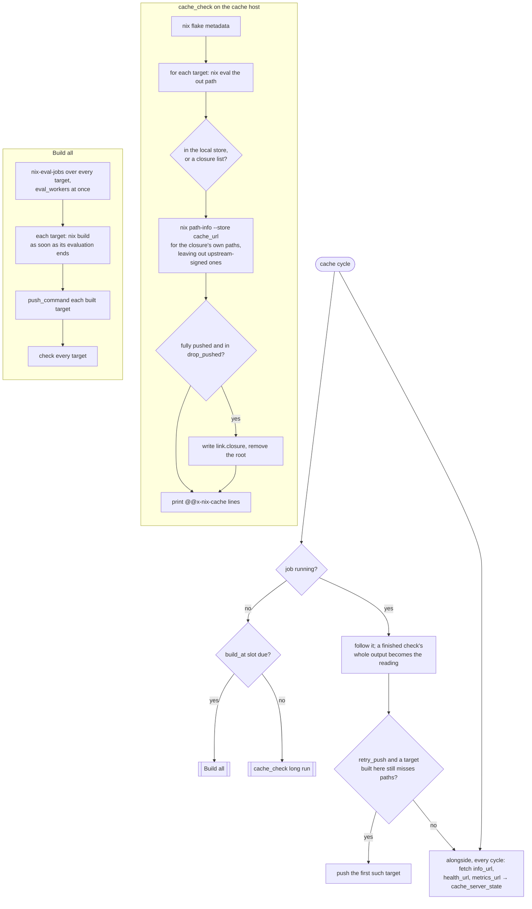
```mermaid
flowchart TD
    cycle([cache cycle]) --> job{job running?}
    job -- yes --> follow[follow it; a finished check's<br/>whole output becomes the reading]
    job -- no --> sched{build_at slot due?}
    sched -- yes --> all[[Build all]]
    sched -- no --> check[[cache_check long run]]
    follow --> retry{retry_push and a target<br/>built here still misses paths?}
    retry -- yes --> push[push the first such target]
    retry -- no --> server_read
    cycle --> server_read[alongside, every cycle: fetch info_url,<br/>health_url, metrics_url → cache_server_state]

    subgraph agent_check[cache_check on the cache host]
        direction TB
        c1[nix flake metadata] --> c2[for each target: nix eval the out path]
        c2 --> c3{in the local store,<br/>or a closure list?}
        c3 --> c4[nix path-info --store cache_url<br/>for the closure's own paths,<br/>leaving out upstream-signed ones]
        c4 --> c5{fully pushed and in drop_pushed?}
        c5 -- yes --> c6[write link.closure, remove the root]
        c5 --> c7[print @@x-nix-cache lines]
        c6 --> c7
    end

    subgraph agent_all[Build all]
        direction TB
        a1[nix-eval-jobs over every target,<br/>eval_workers at once] --> a2[each target: nix build<br/>as soon as its evaluation ends]
        a2 --> a3[push_command each built target]
        a3 --> a4[check every target]
    end
```

## Fleet runs

`src/server/fleet.ts`. Every running run is advanced every five seconds by `Fleet.advance()`, from the stored JSON.

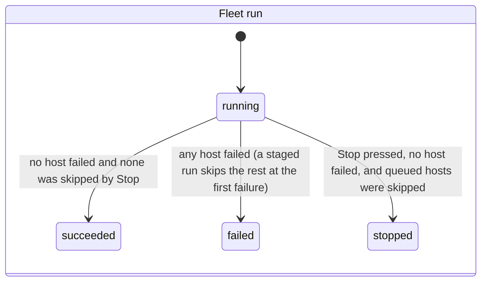
```mermaid
stateDiagram-v2
    state "Fleet run" as run {
        [*] --> running
        running --> succeeded: no host failed and none was skipped by Stop
        running --> failed: any host failed (a staged run skips the rest at the first failure)
        running --> stopped: Stop pressed, no host failed, and queued hosts were skipped
    }
```

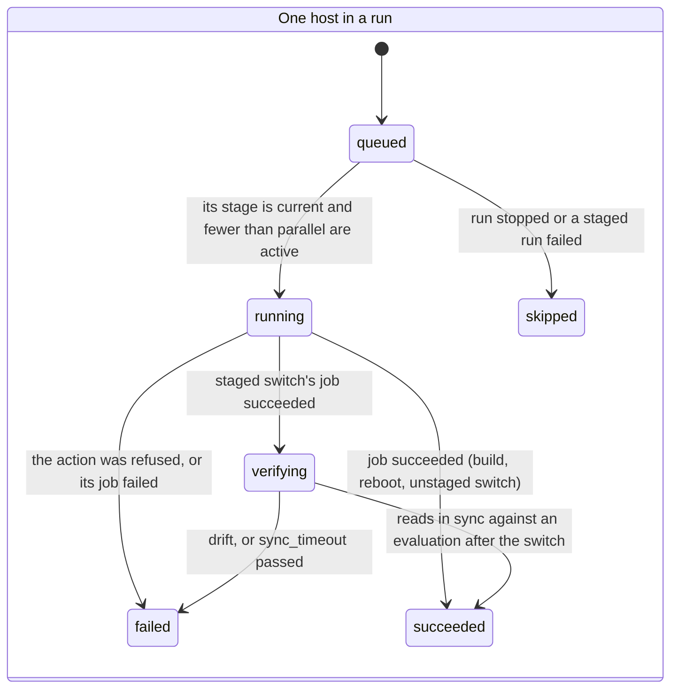
```mermaid
stateDiagram-v2
    state "One host in a run" as host {
        [*] --> queued
        queued --> running: its stage is current and fewer than parallel are active
        queued --> skipped: run stopped or a staged run failed
        running --> failed: the action was refused, or its job failed
        running --> succeeded: job succeeded (build, reboot, unstaged switch)
        running --> verifying: staged switch's job succeeded
        verifying --> succeeded: reads in sync against an evaluation after the switch
        verifying --> failed: drift, or sync_timeout passed
    }
```

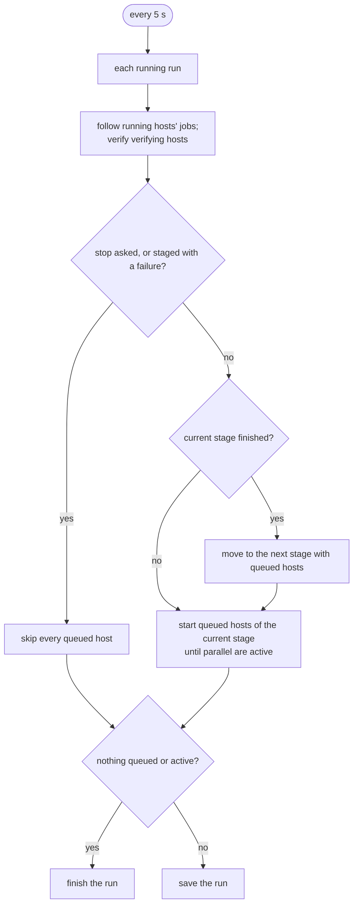
```mermaid
flowchart TD
    tick([every 5 s]) --> each[each running run]
    each --> hosts[follow running hosts' jobs;<br/>verify verifying hosts]
    hosts --> halt{stop asked, or staged with a failure?}
    halt -- yes --> skip[skip every queued host]
    halt -- no --> stage{current stage finished?}
    stage -- yes --> next[move to the next stage with queued hosts]
    stage -- no --> fill
    next --> fill[start queued hosts of the current stage<br/>until parallel are active]
    skip & fill --> end_check{nothing queued or active?}
    end_check -- yes --> finish[finish the run]
    end_check -- no --> save[save the run]
```

## Wake-on-LAN

`AgentPool.start_when_awake()` in `src/server/agents/agent.ts`, `src/server/agents/wake.ts`.

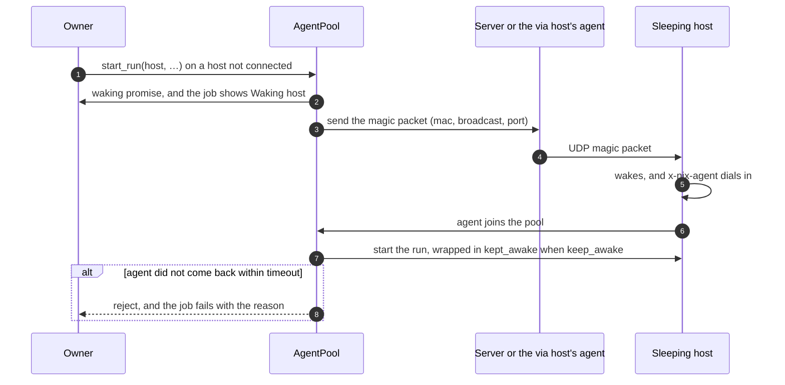
```mermaid
sequenceDiagram
    autonumber
    participant owner as Owner
    participant pool as AgentPool
    participant via as Server or the via host's agent
    participant host as Sleeping host

    owner->>pool: start_run(host, …) on a host not connected
    pool->>owner: waking promise, and the job shows Waking host
    pool->>via: send the magic packet (mac, broadcast, port)
    via->>host: UDP magic packet
    host->>host: wakes, and x-nix-agent dials in
    host->>pool: agent joins the pool
    pool->>host: start the run, wrapped in kept_awake when keep_awake
    alt agent did not come back within timeout
        pool-->>owner: reject, and the job fails with the reason
    end
```

`kept_awake` makes the run hold `systemd-inhibit --what=idle:sleep cat` reading a pipe only the run holds, so the
inhibitor ends when the run ends, however it ends.

## Pull mode

`src/agent/pull.ts`, `src/server/pull_reports.ts`.

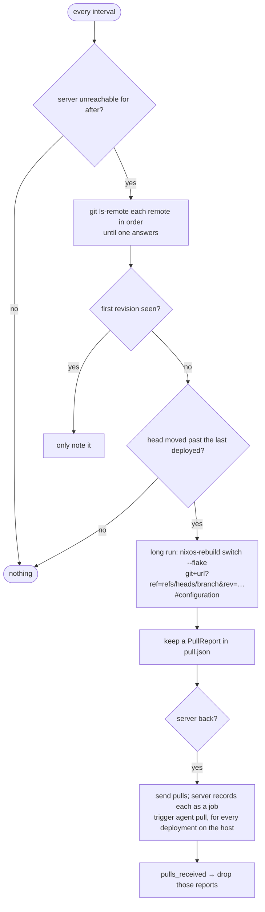
```mermaid
flowchart TD
    tick([every interval]) --> away{server unreachable for after?}
    away -- no --> idle([nothing])
    away -- yes --> ask[git ls-remote each remote in order<br/>until one answers]
    ask --> first{first revision seen?}
    first -- yes --> note[only note it]
    first -- no --> moved{head moved past the last deployed?}
    moved -- no --> idle
    moved -- yes --> sw[long run: nixos-rebuild switch --flake<br/>git+url?ref=refs/heads/branch&rev=…#configuration]
    sw --> keep[keep a PullReport in pull.json]
    keep --> back{server back?}
    back -- yes --> send[send pulls; server records each as a job<br/>trigger agent pull, for every deployment on the host]
    send --> ack[pulls_received → drop those reports]
```

## Provisioning an install

`src/server/provisioning.ts`, `src/agent/operations/provision.ts`.

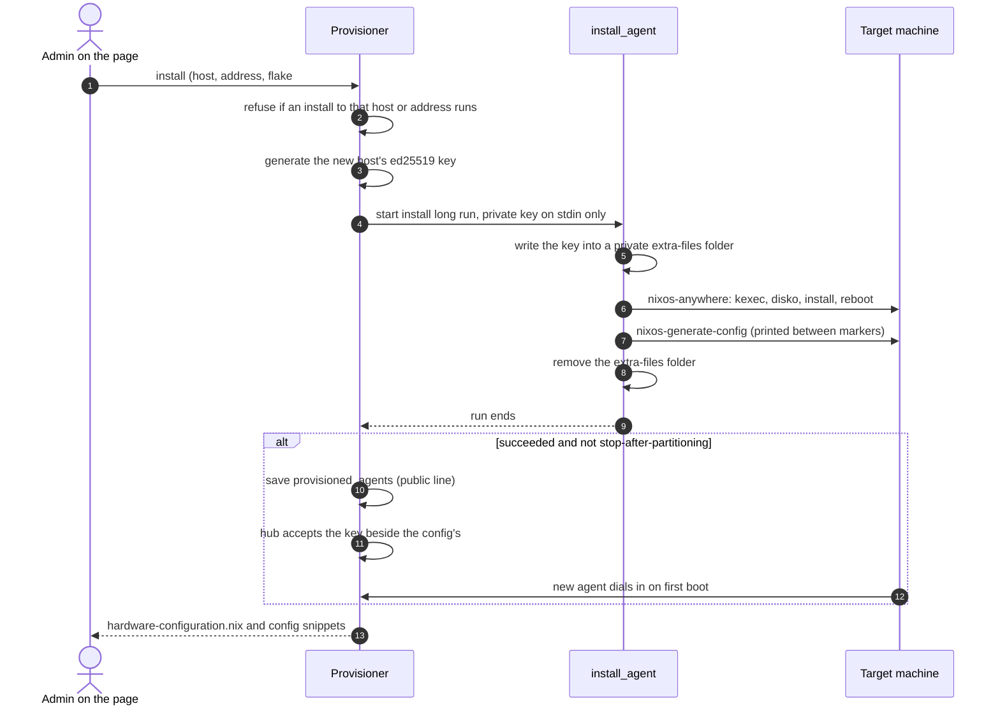
```mermaid
sequenceDiagram
    autonumber
    actor admin as Admin on the page
    participant server as Provisioner
    participant agent as install_agent
    participant target as Target machine

    admin->>server: install (host, address, flake#configuration), address typed to confirm
    server->>server: refuse if an install to that host or address runs
    server->>server: generate the new host's ed25519 key
    server->>agent: start install long run, private key on stdin only
    agent->>agent: write the key into a private extra-files folder
    agent->>target: nixos-anywhere: kexec, disko, install, reboot
    agent->>target: nixos-generate-config (printed between markers)
    agent->>agent: remove the extra-files folder
    agent-->>server: run ends
    alt succeeded and not stop-after-partitioning
        server->>server: save provisioned_agents (public line)
        server->>server: hub accepts the key beside the config's
        target->>server: new agent dials in on first boot
    end
    server-->>admin: hardware-configuration.nix and config snippets
```

## Overdue jobs

`src/server/overdue.ts`.

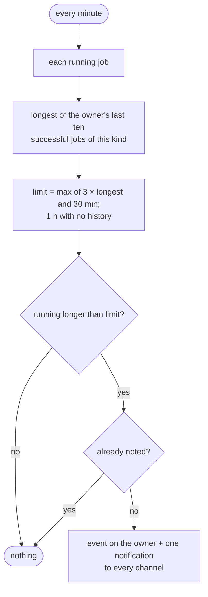
```mermaid
flowchart TD
    tick([every minute]) --> each[each running job]
    each --> longest[longest of the owner's last ten<br/>successful jobs of this kind]
    longest --> limit[limit = max of 3 × longest and 30 min;<br/>1 h with no history]
    limit --> over{running longer than limit?}
    over -- no --> skip([nothing])
    over -- yes --> once{already noted?}
    once -- yes --> skip
    once -- no --> note[event on the owner + one notification<br/>to every channel]
```

While a job is overdue, the owner's reading also carries a warning naming what the job waits on.
